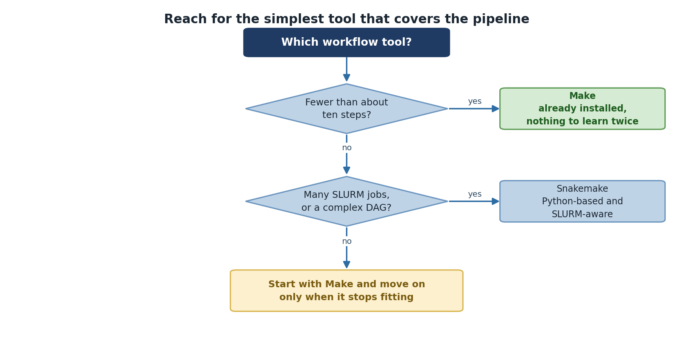

:::::::::::::::::::::::::::::::::::::: questions

- When should I use pip instead of conda?
- What is Docker and when should I use it?
- How do I document HPC module dependencies?

::::::::::::::::::::::::::::::::::::::::::::::::::

::::::::::::::::::::::::::::::::::::: objectives

- Use pip and requirements.txt for pure Python projects
- Understand when Docker provides value over conda
- Document HPC module dependencies for reproducibility

::::::::::::::::::::::::::::::::::::::::::::::::::

## pip and requirements.txt

If you're using pip (outside conda) or mostly installing from PyPI, use `pip freeze`:

```bash
pip freeze > requirements.txt
```

This generates:

```
numpy==1.24.3
pandas==2.0.1
scipy==1.10.1
tensorflow==2.8.0
```

Others install it with:

```bash
pip install -r requirements.txt
```

### Conda vs. pip

- **Use conda if:** You use R, C libraries, or other non-Python dependencies
- **Use pip if:** Your project is pure Python and uses PyPI packages
- **Use both:** Many projects use conda to manage system dependencies and pip to manage Python packages

Best practice -- combine them in `environment.yml`:

```yaml
name: my-project
channels:
  - conda-forge
dependencies:
  - python=3.11
  - numpy=1.24.3
  - scipy=1.10.1
  - pip
  - pip:
    - tensorflow==2.8.0
    - scikit-learn==1.2.2
```

{alt='A decision tree for choosing a workflow tool. If the pipeline has fewer than about ten steps, use Make, which is already installed. If it involves many SLURM jobs or a complex dependency graph, use Snakemake, which is Python-based and SLURM-aware. Otherwise start with Make and move on only when it stops fitting.'}

## Docker: Maximum Environment Control

For even more control, Docker containerizes your entire environment: not just Python packages, but the operating system, all system libraries, compiler versions, everything.

### What Is Docker?

Docker packages your code and environment into a **container**, a lightweight virtual machine. The container includes the operating system, all system libraries, programming languages and compilers, all software packages, and your code.

When you share a Docker container, anyone can run it identically on any machine with no setup needed.

### Dockerfile Example

```dockerfile
FROM python:3.11-slim
WORKDIR /app
COPY . /app
RUN pip install -r requirements.txt
CMD ["python", "analyze.py"]
```

Build and run:

```bash
docker build -t my-analysis .
docker run my-analysis
```

### When to Use Docker

Docker is powerful but adds complexity. Use it when:
- Your environment is complex (many system dependencies, compiled code, specific OS requirements)
- You need to run code on diverse machines (HPC cluster, cloud, collaborator's laptop)
- You want to publish your work with maximum reproducibility
- You're publishing a tool others will use

For simple Python analyses, conda is usually sufficient.

### Docker on HPC

On most HPC clusters, Docker is not available for security reasons. Instead, some clusters support **Singularity**, which is similar to Docker but works in HPC environments:

```bash
# Singularity / Apptainer requires a Singularity recipe file or a docker:// URL, not a raw Dockerfile.
# Modern usage: apptainer build my-image.sif my.def
# Or pull and convert: apptainer build my-image.sif docker://image-name:tag
# NOTE: Singularity Community Edition is now Apptainer (post-2022). Both commands work; prefer apptainer.
singularity run my-image.sif
```

Check with the HPC team at its-hpc@pomona.edu whether Singularity is available on Sagehen.

## Documenting HPC Module Dependencies

On HPC clusters using Lmod, you load modules that provide software:

```bash
module load openmpi
module load r
module load cuda
```

(On Sagehen HPC the real module names are `openmpi/4.1.5_ucx-1.14.0`, `r/4.5.1`,
`cuda/12.2.1`, and so on -- run `module avail` to see what is installed. There
are no `intel`, `fftw`, or `gcc` modules.)

These modify your environment but aren't captured by `conda env export`. Document them in a setup script:

```bash
cat > setup_modules.sh << 'EOF'
#!/bin/bash
module load miniconda3/py313_26.3.2-2
module load openmpi/4.1.5_ucx-1.14.0
conda env create -f environment.yml
conda activate my-project
EOF
chmod +x setup_modules.sh
```

Record your module state:

```bash
module list > modules.txt
```

## Best Practices: Environment Reproducibility Checklist

Include in your repository:

```
my-project/
├── environment.yml           # conda dependencies
├── requirements.txt          # pip dependencies (if any)
├── setup_modules.sh          # HPC module setup
├── modules.txt               # Record of loaded modules
├── Dockerfile                # If using Docker
└── README.md                 # Instructions for setup
```

In your README, provide separate setup instructions for local machines (conda), HPC cluster (Sagehen modules), and Docker (if applicable), along with verification commands to confirm key versions match.

::::::::::::::::::::::::::::::::::::: challenge

## Exercise: Choose Your Environment Strategy

For your research project (or a hypothetical one), decide:

1. **Which tool?** conda, pip, Docker, or a combination?
2. **What dependencies?** List 5-10 key packages your analysis needs.
3. **HPC modules?** If running on Sagehen, which modules do you need?

Write a one-paragraph justification for your choice.

:::::::::::::::::::::::::::::::::::::: solution

## Solution

Example answer for a bioinformatics project:

**Tool:** Conda + pip combination, because I need both Python
packages (pandas, scikit-learn) and bioinformatics tools (samtools,
bwa) that conda-forge and bioconda provide as pre-compiled binaries.

**Dependencies:** python=3.11, numpy, pandas, samtools, bwa,
salmon, pip: deseq2, scanpy

**HPC modules:** `module load miniconda3` (to access conda itself),
no other system modules needed since conda handles everything.

**Justification:** Conda handles the complex binary dependencies
(samtools, bwa) that pip cannot install. Docker would be overkill
since all dependencies are available through conda channels, and
Sagehen provides Apptainer (`module load apptainer`) if a container
is ever needed.

::::::::::::::::::::::::::::::::::::::::::::::

::::::::::::::::::::::::::::::::::::::::::::::

::::::::::::::::::::::::::::::::::::: keypoints

- pip and requirements.txt are alternatives for pure Python projects
- Docker provides maximum reproducibility but adds complexity; useful for complex environments
- On HPC clusters, document module dependencies separately from conda
- Apptainer (formerly Singularity) is the Docker equivalent for HPC clusters where Docker is unavailable -- on Sagehen: `module load apptainer`
- Include environment files, setup scripts, and module lists in your repository

::::::::::::::::::::::::::::::::::::::::::::::
